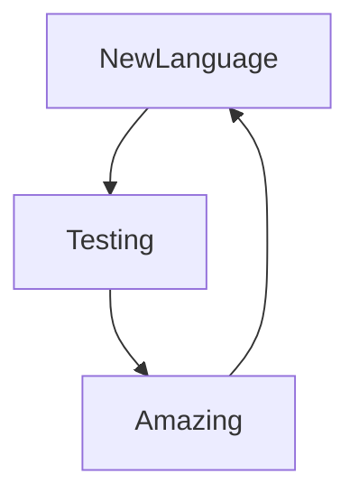

### learning progress: 

---
### Hi people 👋

I'm a developer working on Javascript and i'm from Paris :fr: 

Although I was coding on my own for 2 years,I decided to take courses in order to have the best possible practices

I was studying in the O'Clock school for 6 months to consolidate my
website development knowledge.

Several projects during this training allowed me to have a more precise, clear and efficient code.

Since learning new languages or framework motivates me day by day

You can see my work and projects on this page :hammer_and_wrench:

Let me know if you have questions.

---

### Languages & Tools:

### in loading: 

---

---

### My developer routine 

---

### Connect with me :

                    

--- 

Bye ! :wave:

---
