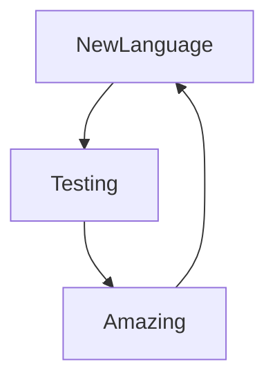

### Hi people 👋

I'm a Junior developer working on Javascript and i'm from Paris :fr: 

You can see my work and projects on this page :hammer_and_wrench:

I can develop on Javascript back and front with some tools.

---

### Languages & Tools:

and other languages are in loading...:construction:

---

---

### My developer routine 

---

### Connect with me :

---
Enjoy my git and tell me what you think about my projects . My Linkedin and my mail are in my description 

Bye ! :wave:
